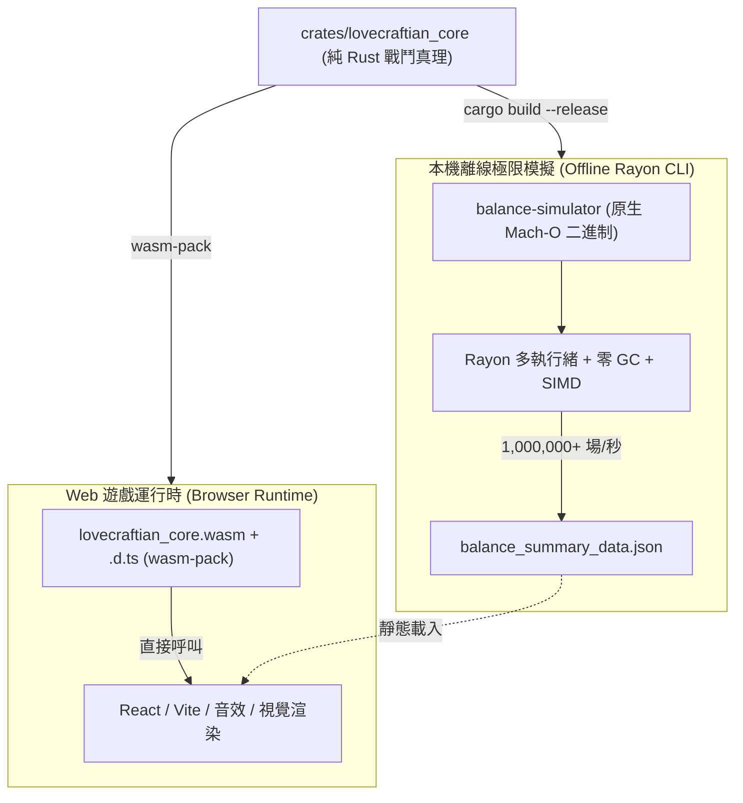

# 0037. 戰鬥核心 Rust/Wasm 統一化架構與唯一事實來源 (Rust/Wasm Unified Combat Core & Single Source of Truth)

## 狀態 (Status)

Proposed / Roadmap（預期未來演進架構，補充 ADR-0029、ADR-0035 與 ADR-0036）

## 脈絡與問題陳述 (Context & Problem Statement)

在 ADR-0036 中，我們實現了雙軌啟發式模擬器與分層正交蒙地卡羅平衡採樣。在單核 V8 引擎下，TypeScript 單場對局已達 13,200 場/秒（多執行緒約 10 萬場/秒），能在 5~8 秒內完成 73 張卡牌、6 種遺物與 26 隻怪物的全量分層模擬。

然而，當我們進一步探討**「多卡全排列組合窮舉」**（例如 2,628 種雙卡全協同矩陣、62,196 種三卡連鎖構裝）時，對弈次數將上升至數千萬至數億場：
1. **TypeScript 的算力上限**：面對數千萬場對局，TypeScript 需要 15~30 分鐘，難以達成「一鍵秒級回饋」。
2. **重寫獨立 Rust 腳本的雙重維護陷阱 (Dual Maintenance Drift)**：
   若僅在終端以 Rust 重新實現模擬腳本，而遊戲前端仍運行 TypeScript，會形成**兩套戰鬥規則與數值代碼**。每當新增卡牌、調整敵怪特質（如非歐流體反彈、修格斯器官姿態）或修正洗牌規則時，必須同時維護 TS 與 Rust，極易因細微實作差異導致模擬平衡性數據失真。

## 決策內容 (Decision)

經架構評估，確立**「以 Rust 打造唯一事實來源（Single Source of Truth），同時編譯為 WebAssembly 與原生二進制」**的終極演進藍圖：

### 1. 核心 Rust Crate (`crates/lovecraftian_core`)

將所有**純數值與戰鬥物理規則**集中於純 Rust Crate，不再由 TypeScript 獨立實現：
- **卡牌與印記系統**：73 張卡牌效果解析、狀態印記（易傷、力量、流血等）疊加與衰退。
- **敵怪與特質系統**：26 隻敵怪規格、意圖推進、傷害攔截與特質邏輯。
- **回合生命週期**：Fisher-Yates 隨機洗牌、抽牌、瘋狂卡生成、終局勝負判定。
- **雙軌啟發式決策器**：1-Ply 當前回合最優順序求解與次優噪聲壓力測試。

### 2. 雙目標編譯管道 (Dual-Target Compilation Pipeline)

- **目標一：WebAssembly (`wasm-pack`)**
  - 編譯為 `.wasm` 模組與自動生成的 TypeScript 定義檔（`.d.ts`）。
  - Vite 藉由 `vite-plugin-wasm` 整合，React 介面在玩家出牌與回合結束時直接呼叫 Wasm 函式。
  - **達成效果**：遊戲前端享有原生級執行效能，且與模擬器底層規則 100% 同一源頭，零代碼重複。
- **目標二：本機原生機器碼 (`cargo run --release`)**
  - 編譯為 Native 二進制程式，結合 `Rayon` 跨核心無鎖並發。
  - **達成效果**：達到每秒 $1,000,000 \sim 3,000,000$ 場對弈，能在 10~80 秒內徹底窮舉雙卡全矩陣與三卡連招。

### 3. 實施階段規劃 (Staging & Transition)

- **近期（現行階段）**：
  維持 TypeScript 純函數模擬器（[src/engine/simulation/](file:///Users/sandbox1/Documents/文字冒險遊戲/src/engine/simulation/)）與 Node.js Worker Threads，以 5~8 秒完成全量 73 卡單卡與流派分層模擬，先行交付 Issue #63、#64 與 #65。
- **遠期（Rust 重構里程碑）**：
  啟動專屬重構 Issue，將 `src/engine/` 下的純戰鬥核心（`evaluator`, `turnResolver`, `enemyTraits`, `statusEffects`, `relics`）抽離並遷徙至 `crates/lovecraftian_core`。

## 影響與後續效果 (Consequences)

1. **唯一事實來源保證**：徹底消除未來平衡性調整時的雙重維護成本與邏輯脫鉤風險。
2. **算力突破數量級**：從 10 萬場/秒躍升至百萬場/秒，使組合爆炸的更深層維度（雙卡與三卡全排列）可被離線徹底窮舉。
3. **前端零負擔**：React 前端僅保留視覺渲染與事件傳遞，底層計算交由 Wasm，大幅降低垃圾回收（GC）引起的掉幀。
