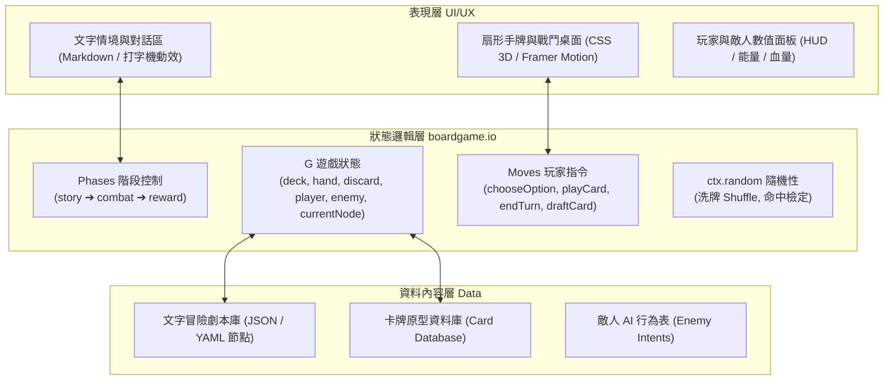

# 方案五深度調查：boardgame.io 桌遊狀態機 ＋ 模組化文字劇本混血架構

本報告針對「方案五（以 `boardgame.io` 狀態機為核心，結合模組化文字劇本與現代 Web UI）」提供完整的架構設計、可用開源模板、核心代碼實現範例與免費遊戲資產清單。

---

## 1. 系統整體架構藍圖 (Architecture Blueprint)

方案五將遊戲拆分為三層：**「敘事層（Narrative）」**、**「狀態邏輯層（Engine）」** 與 **「表現互動層（UI/UX）」**。



---

## 2. 核心技術選型與開源庫清單

### 2.1 底層狀態與規則引擎：`boardgame.io`
* **專案網址**：[https://github.com/boardgameio/boardgame.io](https://github.com/boardgameio/boardgame.io)
* **官方文檔**：[https://boardgame.io/documentation/](https://boardgame.io/documentation/)
* **核心價值**：
  * **確定性隨機洗牌**：內建 `ctx.random.Shuffle(array)`，保證洗牌結果受控、可重現且杜絕客戶端同步 Bug。
  * **Phases（階段）切換機制**：天生適合「平時在 `story` 階段閱讀對話，進入戰鬥時切換至 `combat` 階段，獲勝後進入 `reward` 階段」。
  * **Moves（操作）純函數**：出牌、耗費能量、扣減敵人護甲與生命，全部寫在乾淨的純函數中，極度容易撰寫單元測試。

### 2.2 文字冒險與劇情解析
* **方案選項**：
  1. **輕量 JSON 節點樹（推薦首選）**：最直觀，每個節點包含 `text`、`choices`、以及可選的 `combatEncounter`。
  2. **[inkjs](https://github.com/inkle/inkjs)**：若希望使用業界標準的 Inkle Ink 語法來撰寫複雜分支劇情，可將 `inkjs` 嵌入到 React 中，遇到特殊標籤（如 `# COMBAT: skeleton_knight`）時通知 `boardgame.io` 切換至戰鬥階段。
* **排版與字型**：
  * 使用 Google Fonts 的 **Noto Serif TC (思源宋體)** 或 **Cinzel**，營造古典奇幻冒險的沉浸閱讀氛圍。

### 2.3 卡牌 UI 與動態手感
* **[Motion (Framer Motion)](https://github.com/motiondivision/motion)**：
  * **手牌扇形展開算式（Fan-out math）**：根據手牌張數動態計算旋轉角度與 Y 軸偏移：
    $$\text{rotate} = (i - \frac{N - 1}{2}) \times \theta$$
    $$\text{offsetY} = |i - \frac{N - 1}{2}|^2 \times k$$
  * **懸浮聚焦（Hover lift）**：游標滑過卡牌時自動拔出、放大至最前層（`scale: 1.15`, `zIndex: 50`）。
  * **拖曳出牌（Drag & Drop）**：使用 `drag="y"` 與 `dragConstraints`，向上滑動超出閥值即觸發 `playCard`。

---

## 3. 開源免費美術與音效資源庫 (Assets)

| 資源類別 | 推薦來源 | 授權協議 | 特色與用途 |
| :--- | :--- | :--- | :--- |
| **卡牌/技能圖標** | **[game-icons.net](https://game-icons.net/)** | CC BY 3.0 (標註來源即可免費商用) | 包含超過 4,000+ 個奇幻、戰鬥、法術、道具 SVG 圖標。在 React 中可直接透過 `react-icons/gi` 套件以組件形式引用。 |
| **卡牌邊框與 UI** | **[Kenney.nl (Board Game / UI Assets)](https://kenney.nl/assets/boardgame-pack)** | **CC0 (公有領域，完全無限制)** | 提供完整的撲克牌、奇幻卡牌邊框、底圖、按鈕與指示物。 |
| **介面與出牌音效** | **[Kenney.nl (Interface / RPG Sounds)](https://kenney.nl/assets/interface-sounds)** | **CC0** | 包含卡牌滑動抽牌聲（Card Slide）、洗牌聲、點擊按鈕聲與魔法音效。 |
| **奇幻背景圖片** | **AI 生成 或 OpenGameArt** | CC0 / MIT | 地城、酒館、黑森林等場景背景圖。 |

---

## 4. 關鍵模組代碼範例 (Code Walkthrough)

### 4.1 狀態機核心架構 (`src/game/index.ts`)

```typescript
import { Game } from 'boardgame.io';

export interface Card {
  id: string;
  name: string;
  cost: number;
  type: 'attack' | 'defense' | 'skill';
  value: number;
  description: string;
  icon: string;
}

export interface GameState {
  // 敘事狀態
  currentStoryId: string;
  storyHistory: string[];
  
  // 玩家與牌庫
  playerHp: number;
  playerMaxHp: number;
  energy: number;
  maxEnergy: number;
  deck: Card[];
  hand: Card[];
  discardPile: Card[];
  
  // 當前戰鬥
  enemy: {
    name: string;
    hp: number;
    maxHp: number;
    intent: { type: 'attack' | 'defend'; value: number };
  } | null;
}

export const TextCardAdventureGame: Game<GameState> = {
  name: 'text-card-adventure',

  setup: ({ ctx }) => ({
    currentStoryId: 'intro_crossroad',
    storyHistory: [],
    playerHp: 80,
    playerMaxHp: 80,
    energy: 3,
    maxEnergy: 3,
    deck: [
      { id: '1', name: '斬擊', cost: 1, type: 'attack', value: 6, description: '造成 6 點傷害', icon: 'GiSwordSlice' },
      { id: '2', name: '斬擊', cost: 1, type: 'attack', value: 6, description: '造成 6 點傷害', icon: 'GiSwordSlice' },
      { id: '3', name: '格擋', cost: 1, type: 'defense', value: 5, description: '獲得 5 點護盾', icon: 'GiShield' },
      { id: '4', name: '格擋', cost: 1, type: 'defense', value: 5, description: '獲得 5 點護盾', icon: 'GiShield' },
      { id: '5', name: '專注凝神', cost: 0, type: 'skill', value: 1, description: '抽 1 張牌並獲得 1 點能量', icon: 'GiMeditation' },
    ],
    hand: [],
    discardPile: [],
    enemy: null,
  }),

  phases: {
    // 階段一：文字冒險與對話
    story: {
      start: true,
      moves: {
        chooseStoryOption: ({ G, events }, targetNodeId: string, triggerCombat?: any) => {
          G.storyHistory.push(G.currentStoryId);
          G.currentStoryId = targetNodeId;

          // 若該選項觸發戰鬥，初始化敵人並切換到戰鬥階段
          if (triggerCombat) {
            G.enemy = {
              name: triggerCombat.enemyName,
              hp: triggerCombat.hp,
              maxHp: triggerCombat.hp,
              intent: { type: 'attack', value: 8 },
            };
            events.setPhase('combat');
          }
        },
      },
    },

    // 階段二：回合制卡牌對戰
    combat: {
      onBegin: ({ G, ctx }) => {
        // 洗牌並抽取 4 張起始手牌
        G.deck = ctx.random.Shuffle(G.deck);
        G.hand = G.deck.splice(0, 4);
        G.energy = G.maxEnergy;
      },
      moves: {
        playCard: ({ G }, cardIndex: number) => {
          const card = G.hand[cardIndex];
          if (!card || G.energy < card.cost) return;

          // 扣除能量
          G.energy -= card.cost;

          // 執行卡牌效果
          if (card.type === 'attack' && G.enemy) {
            G.enemy.hp = Math.max(0, G.enemy.hp - card.value);
          }

          // 移入手牌至棄牌堆
          G.discardPile.push(card);
          G.hand.splice(cardIndex, 1);
        },

        endTurn: ({ G, ctx, events }) => {
          // 敵人行動
          if (G.enemy && G.enemy.hp > 0) {
            if (G.enemy.intent.type === 'attack') {
              G.playerHp = Math.max(0, G.playerHp - G.enemy.intent.value);
            }
          }

          // 檢查勝負
          if (G.enemy && G.enemy.hp <= 0) {
            events.setPhase('reward');
            return;
          }

          // 回合重置：棄掉殘存手牌，補滿能量，抽取新回合手牌
          G.discardPile.push(...G.hand);
          G.hand = [];
          if (G.deck.length < 4) {
            G.deck.push(...ctx.random.Shuffle(G.discardPile));
            G.discardPile = [];
          }
          G.hand = G.deck.splice(0, 4);
          G.energy = G.maxEnergy;
        },
      },
    },

    // 階段三：戰利品與戰後劇情回歸
    reward: {
      moves: {
        claimRewardAndContinue: ({ G, events }, nextStoryNodeId: string) => {
          G.enemy = null;
          G.currentStoryId = nextStoryNodeId;
          events.setPhase('story');
        },
      },
    },
  },
};
```

---

### 4.2 文字劇本資料結構範例 (`src/data/storyNodes.json`)

```json
{
  "intro_crossroad": {
    "title": "幽暗林道分歧處",
    "text": "月光穿透乾枯的枝椏，在潮濕的泥土上映照出冰冷的光暈。前方是一座廢棄的神殿廢墟，石柱上刻滿了古老的警示符文；右側則傳來微弱的篝火劈啪聲與含糊的低語。",
    "choices": [
      {
        "label": "走向廢墟調查古代符文",
        "targetNode": "ruins_investigate"
      },
      {
        "label": "拔劍靠近篝火巡視",
        "targetNode": "campfire_ambush",
        "triggerCombat": {
          "enemyName": "林地劫掠者",
          "hp": 24
        }
      }
    ]
  }
}
```

---

## 5. 專案落地三階段實施路線圖 (Implementation Roadmap)

1. **第 1 階段：核心狀態骨架搭建（1-2 天）**
   * 初始化 Vite + React + TypeScript 專案。
   * 安裝 `boardgame.io`、`lucide-react` / `react-icons` 與音效套件 `use-sound`。
   * 建立基本文字冒險節點跳轉與 `story` / `combat` 階段流轉。

2. **第 2 階段：卡牌戰鬥與牌組構築深化（2-3 天）**
   * 實現卡牌費用、攻擊、防禦、抽牌、狀態（中毒/虛弱）運算。
   * 導入 Framer Motion 扇形手牌展開與拖曳出牌動效。
   * 戰勝後卡牌三選一（Card Draft）牌組構築功能。

3. **第 3 階段：美學氛圍與聲光打磨（1-2 天）**
   * 深色暗黑奇幻主題、思源宋體排版、打字機文字漸顯效果。
   * 加入 Kenney.nl CC0 出牌抽牌音效、擊中震動與粒子微光。

---

## 6. 參考來源 (Primary Sources)
* **boardgame.io 官方專案**：[https://github.com/boardgameio/boardgame.io](https://github.com/boardgameio/boardgame.io)
* **Framer Motion 手牌堆疊動效規範**：[https://www.motion.dev/docs/examples](https://www.motion.dev/docs/examples)
* **Kenney 免費開源遊戲素材**：[https://kenney.nl/assets](https://kenney.nl/assets)
* **Game Icons 向量圖標庫**：[https://game-icons.net/](https://game-icons.net/)
