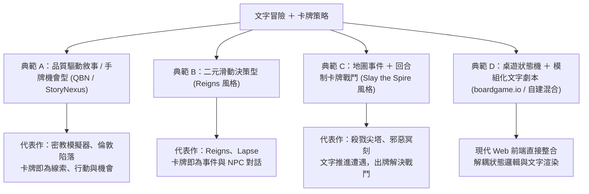

# 文字冒險 ＋ 卡牌策略遊戲：GitHub 方案選項與深度評估報告

本研究報告針對「文字冒險（Text Adventure / Interactive Fiction）」結合「卡牌策略（Card Strategy / Deckbuilder）」之遊戲類型，深入調查 GitHub 上的開源模板、框架與引擎方案，分析各方案的設計模式、技術棧、架構優劣勢，並提供具體的選型建議。

---

## 1. 核心設計典範（Design Archetypes）

在將「文字冒險」與「卡牌策略」融合時，業界與開源社群主要衍生出四大設計典範：

---

## 2. GitHub 開源方案選項與深度評估

### 方案一：品質驅動敘事型（QBN / StoryNexus 風格）
> **核心機制**：玩家累積屬性/特質（Qualities），牌庫根據特質動態解鎖「機會卡（Opportunity Cards）」。卡牌代表一件事件、一個線索或一次探索行動。

#### 1. [aucchen/dendrynexus](https://github.com/aucchen/dendrynexus) (基於 [dendry/dendry](https://github.com/dendry/dendry))
* **技術棧**：JavaScript / Node.js
* **核心設計**：
  * 作為知名互動敘事引擎 *Dendry* 的超集，專門逆向重現過去《StoryNexus》（即《倫敦陷落 / Fallen London》底層平台）的卡牌機會與抽牌池機制。
  * 支援手牌上限、自訂抽牌堆、牌面冷卻時間（Cooldown）、以及基於特質數值的成功率檢定。
* **優點**：
  * **敘事與卡牌完美統一**：卡牌本身就是段落故事，玩家不是為了「打怪」出牌，而是為了「推進劇情」出牌。
  * 腳本語法簡潔，專注於文學創作。
* **缺點**：
  * 架構較舊，缺乏現代響應式前端 UI，需要自行美化介面。
  * 不適合有複雜數值對戰、手牌連鎖（Combo）的即時戰鬥。

#### 2. [Randozart/chronicle-hub](https://github.com/Randozart/chronicle-hub)
* **技術棧**：TypeScript / Next.js / React
* **核心設計**：
  * 現代開源的 StoryNexus 精神續作平台，內建專用劇本解析器「ScribeScript」。
  * 原生支援 Web 前端現代組件庫，包含牌庫抽取池與複雜的屬性條件追蹤。
* **優點**：現代化技術棧，介面容易透過 Tailwind/CSS 進行客製。
* **缺點**：屬於較完整的平台系統，若只想做單機小型文字遊戲，專案規模偏重。

---

### 方案二：二元滑動決策型（Reigns 風格）
> **核心機制**：每張卡牌展示一段文字描述與當前遭遇角色，玩家向左或向右滑動做出決策，即時改變資源與數值平衡。

#### 1. [Sisyphe42/ReignsAgent](https://github.com/Sisyphe42/ReignsAgent)
* **技術棧**：Python / Node.js / Web
* **核心設計**：
  * 提供完整的 Reigns 風格文字二元敘事創作工作台（Authoring Workbench）與獨立播放器（Player Runtime）。
  * 包含自動校驗器，確保劇本中不會出現死循環或無法觸發的孤兒分支。
* **優點**：
  * 包含完整工具鏈，編寫劇本體驗極佳。
  * 對於注重劇情節奏、管理資源平衡（如：金錢、生命、民心、理智）的遊戲是最佳起點。
* **缺點**：
  * 策略維度偏向「資源平衡」而非「牌組構築（Deckbuilding）」，無法體驗自由組牌或抽牌出招的樂趣。

#### 2. [mramadhanrh/react-reigns-card](https://github.com/mramadhanrh/react-reigns-card)
* **技術棧**：React / TypeScript / Framer Motion
* **核心設計**：專案封裝了高品質的卡牌物理滑動反饋、傾斜旋轉與選擇提示文字。
* **優點**：可直接作為 React Web 專案的手感組件，輕量易整合。
* **缺點**：僅提供 UI 互動層，劇本狀態機需另行掛接。

---

### 方案三：地圖事件 ＋ 回合制卡牌戰鬥（Slay the Spire 風格）
> **核心機制**：雙層循環 —— 大地圖上為文字情境節點（對話、隨機事件、寶箱、商店）；進入戰鬥節點時，切換為「抽手牌、耗費費用、攻擊防禦、牌組循環」的策略戰鬥。

#### 1. [nicklemmon/react-deckbuilder](https://github.com/nicklemmon/react-deckbuilder) (Web 推薦)
* **技術棧**：React / TypeScript / XState
* **核心設計**：
  * 採用 **XState 狀態機** 精確管理戰鬥流程：`PlayerTurn`（抽牌、費用刷新、出牌）➔ `EnemyTurn`（敵人意圖執行、護甲重置）➔ `RewardPhase`（選卡獎勵、牌組加入）。
  * 完全用 Web DOM 與 CSS 構建，包含卡牌渲染與手牌區佈局。
* **優點**：
  * **架構清晰強健**：透過狀態機處理回合制邏輯，能杜絕各類異步操作引起的狀態不一致（如快速出牌出錯）。
  * **純 Web 原生**：跨平台零門檻，文字渲染與排版極致彈性，易與 Markdown/對話組件共存。
* **缺點**：
  * 原專案視覺樣式較樸素，需要補強現代 CSS 動畫（例如卡牌飛行動畫、打擊震動特效）。

#### 2. [DesirePathGames/Slay-The-Robot](https://github.com/DesirePathGames/Slay-The-Robot) (Godot 引擎)
* **技術棧**：Godot Engine 4 (GDScript)
* **核心設計**：
  * 針對 Godot 開發的標準 Roguelike Deckbuilder 框架，擁有數據驅動的 Card/Relic/Effect 資源系統。
* **優點**：
  * 2D 動畫、粒子特效、卡牌拋物線拖曳手感最為優秀。
* **缺點**：
  * 需要安裝 Godot 引擎本體，不能直接在瀏覽器或純 Node 環境原生編輯；長篇純文字的排版與字型支援度略不如 Web 技術方便。

#### 3. [Arefnue/NueDeck](https://github.com/Arefnue/NueDeck) (Unity 引擎)
* **技術棧**：Unity / C#
* **核心設計**：開源社群最知名的 Unity 卡牌模板，以 ScriptableObject 管理卡牌與數值。
* **優點**：架構完整、手牌扇形排列與戰鬥手感達到商業水準。
* **缺點**：Unity 專案體積大、版本相容性易出問題，對於「文字冒險」為主體的輕量開發過於笨重。

---

### 方案四：桌遊狀態機 ＋ 自訂文字劇本混血型（boardgame.io）
> **核心機制**：將遊戲核心邏輯視為純粹的狀態轉換，UI 完全自由構建。

#### 1. [boardgameio/boardgame.io](https://github.com/boardgameio/boardgame.io)
* **技術棧**：JavaScript / TypeScript (Redux-inspired 狀態機架構)
* **核心設計**：
  * 提供 `G`（遊戲資料）、`ctx`（回合與元資料）、`moves`（玩家操作如出牌、抽牌）、`phases`（階段劃分如事件階段、出牌階段）。
* **優點**：
  * **極致解耦**：遊戲邏輯與顯示層完全分離，容易進行單元測試與模擬對戰。
  * 內建牌庫（Deck）、洗牌（Shuffle）、手牌（Hand）等輔助工具函數。
  * 未來可無縫擴充為雙人對戰或網路連線。
* **缺點**：
  * 不提供任何 UI，所有畫面與動畫需要開發者自行構建。

---

## 3. 全方位對比矩陣

| 評估維度 | 方案一：QBN 敘事手牌 (DendryNexus) | 方案二：Reigns 滑動決策 (ReignsAgent) | 方案三：Web 卡牌戰鬥 (react-deckbuilder) | 方案四：專用遊戲引擎 (Godot Slay-The-Robot) | 方案五：狀態機混血 (boardgame.io + Markdown) |
| :--- | :--- | :--- | :--- | :--- | :--- |
| **文字冒險表現力** | ⭐⭐⭐⭐⭐ (極強，文字即本體) | ⭐⭐⭐⭐ (節奏明快) | ⭐⭐⭐⭐ (事件與戰鬥切換) | ⭐⭐⭐ (文字支援普通) | ⭐⭐⭐⭐⭐ (完全自由控制) |
| **卡牌策略深度** | ⭐⭐⭐ (資源管理、機率檢定) | ⭐⭐ (二選一數值平衡) | ⭐⭐⭐⭐⭐ (費用、手牌連鎖) | ⭐⭐⭐⭐⭐ (數值、遺物、連鎖) | ⭐⭐⭐⭐⭐ (任意自訂規則) |
| **上手開發門檻** | ⭐⭐ (舊語法需適應) | ⭐ (開箱即用) | ⭐⭐ (需具備 React/TS 基礎) | ⭐⭐⭐ (需學習 Godot) | ⭐⭐ (需具備 TS/狀態機思維) |
| **跨平台與部署** | 網頁 (靜態 HTML) | 網頁 (靜態 HTML) | 網頁 (Vercel/GitHub Pages) | PC 執行檔 / WebAssembly | 網頁 (零伺服器/靜態部署) |
| **代碼靈活度** | 中等 | 低 (受限於二元滑動) | 高 (組件化自由組裝) | 高 (遊戲引擎控制) | 最高 (邏輯完全解耦) |

---

## 4. 針對本專案之最佳實踐與實作建議

結合本專案工作區（`文字冒險遊戲`）以及希望兼具**「文字敘事沉浸感」**與**「卡牌策略操作感」**的目標，提出兩條落地路線：

### 推薦路線 A：現代 Web 原生混血架構（靈活度最高、視覺精緻、啟動最快）
* **技術選型**：
  * **前端核心**：Vite + React / TypeScript + Vanilla CSS / TailwindCSS。
  * **狀態管理**：狀態機模式（參考 `react-deckbuilder` 或 Zustand/useReducer）。
  * **卡牌手感**：CSS 3D Transform + Framer Motion，實現手牌懸浮、抽出聚焦、滑動打擊感。
  * **劇本驅動**：JSON 或 YAML 劇本檔，定義每個章節節點（故事文本、背景氣氛、分支選項、觸發的卡牌遭遇戰）。
* **核心優勢**：
  * 可以完美呈現精緻的深色模式、排版美學、漸層發光等現代 Web 視覺。
  * 劇情事件與出牌對戰無縫切換，無須負擔大型遊戲引擎的載入延遲。

### 推薦路線 B：Reigns 敘事卡牌路線（敘事為主、最快上線體驗）
* **技術選型**：
  * 採用 `react-reigns-card` 互動架構，將所有文字冒險的情境（如「遇到神秘旅人」、「發現廢棄神廟」）直接作為卡牌呈現，玩家以左滑（謹慎/拒絕）或右滑（冒險/接受）做出策略抉擇。
* **核心優勢**：
  * 專注於劇本文案與數值天秤設計，適合以劇情為主導的遊戲。

---

## 5. 結論與資料來源（Primary Sources）

1. **react-deckbuilder**: [https://github.com/nicklemmon/react-deckbuilder](https://github.com/nicklemmon/react-deckbuilder)
2. **boardgame.io**: [https://github.com/boardgameio/boardgame.io](https://github.com/boardgameio/boardgame.io)
3. **Dendry & DendryNexus**: [https://github.com/dendry/dendry](https://github.com/dendry/dendry) 與 [https://github.com/aucchen/dendrynexus](https://github.com/aucchen/dendrynexus)
4. **ReignsAgent**: [https://github.com/Sisyphe42/ReignsAgent](https://github.com/Sisyphe42/ReignsAgent)
5. **Slay-The-Robot (Godot)**: [https://github.com/DesirePathGames/Slay-The-Robot](https://github.com/DesirePathGames/Slay-The-Robot)
6. **NueDeck (Unity)**: [https://github.com/Arefnue/NueDeck](https://github.com/Arefnue/NueDeck)
